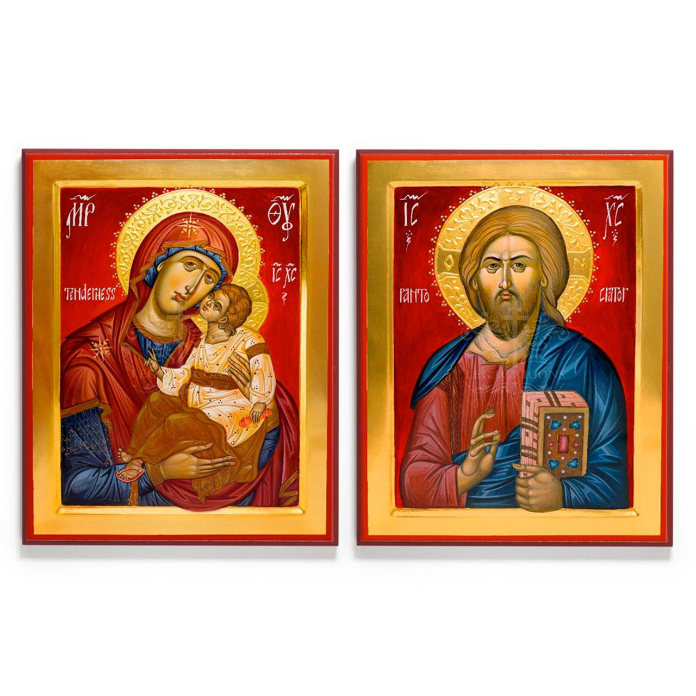
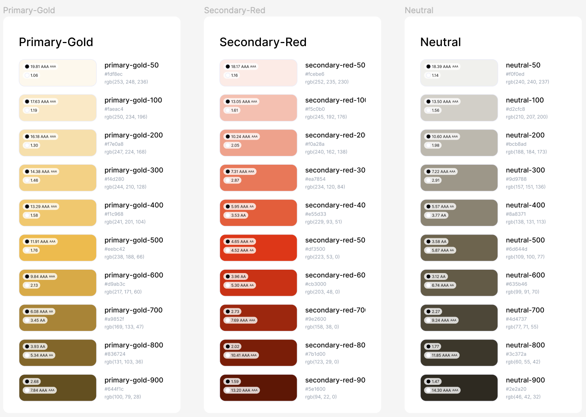
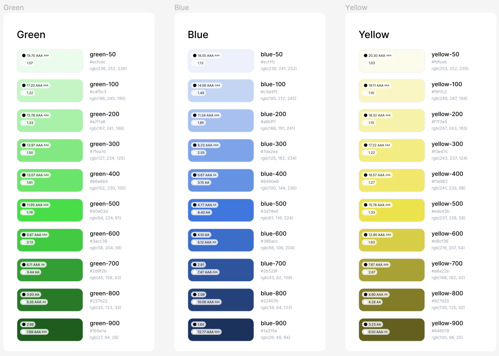

# Synaxis Style Guide

The Synaxis style guide was influenced primarily by the gold and red colors used in Orthodox liturgical vestments and iconography. For this reason, gold (#EEBC42) and red (#DF3500) are our primary and secondary brand colors, respectively.

## Color Palette

Alongside the shades of our primary and secondary brand colors are support colors: neutral shades, blue shades for informative components, green shades for success messages, and yellow shades for warning messages.

## Typography

### Synaxis H1 Font

Our "The Synaxis App" H1 heading uses a special font:

### Headings

Our paragraph text throughout the site and the app use the Serif Sans Pro font. Font sizes are as follows:

- Heading-H1: 48px
- Heading-H2: 32px
- Heading-H3: 28px
- Heading-H4: 24px
- Heading-H5: 20px
- Heading-H6: 16px

### Body

Our paragraph text throughout the site and the app use the Serif Sans Pro font. Font sizes are as follows:

- Body-2XL: 24px
- Body-XL: 20px
- Body-LG: 16px
- Body-MD: 14px
- Body-SM: 12px
- Body-XS: 10px

## Icons

The Synaxis UI uses the HeroIcons collection for our icons.

For performance, where possible the icons have been exported from Figma as SVG files.

## Tailwind

The Synaxis UI uses Tailwind for styling. All of the above information should be seen in the [tailwind.config.js](/tailwind.config.ts) file, with the exception of icons.